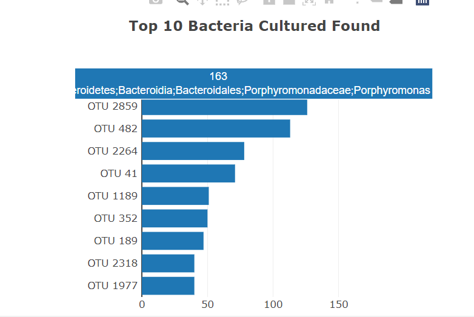

# Plotly
## Overview
Rosa is a biological researcher and her role is to document the known and unknown bacteria information

Rosa thinks that there is a microorganism which supplies the next best taste and believes the bacteria can be found on human body

**Hypothesis** : The ideal bacterial species to make synthetic beef can be found in belly button or atleast someone's belly botton.

To prove the hypothesis she takes samples of people in her neighbourhood and across the countries. She knows that she wants to create engaging and dynamic charts. It's her task to identify the best way to share her information with her audience.

### Delivery 1 - Horizontal Bar Chart
For each Test ID subject Number the Bar chart is created. 
Bar chart displays OTU 
<p align="center"> </p>

The following code generates the above chart

```python
var otu_ids 
   var otu_labels
   var sample_values  


    // 7. Create the yticks for the bar chart.
    // Hint: Get the the top 10 otu_ids and map them in descending order  
    //  so the otu_ids with the most bacteria are last. 
    otu_ids = result.otu_ids.sort((firstID, secondID) => secondID.id- firstID.id)
  //  otu_ids = top10Data.map(otu_ids => otu_ids.id)

    otu_labels = result.otu_labels.sort((first, second) => second- first)
    sample_values = result.sample_values.sort((first, second) => second- first)
    console.log(sample_values)
      
    var yticks = otu_ids.slice(0,10).map(otu_ids => `OTU ${otu_ids} `).reverse()

    // 8. Create the trace for the bar chart. 
    
    var barData = [{
      x           :sample_values.slice(0,10).reverse(),
      y           :yticks,
      text        :otu_labels.slice(0,10).reverse(),
      type        :"bar",
      orientation :"h",
      mode        :"markers",
      hoverlabel  : {bgcolor: "white", font: {color: 'red', font_family:"Verdana"} }
     
    }];
    // 9. Create the layout for the bar chart. 
    var barLayout = { title : "<b>Top 10 Bacteria Cultured Found</b>" };
    // 10. Use Plotly to plot the data with the layout. 
    Plotly.newPlot("bar", barData, barLayout);

```

### Delivery 2: Bubble Chart
For each Test ID subject Number the Bubble chart is created.
<p align="center"></p>

Code to generate above chart

``` python
     // 11. Create the trace for the bubble chart.
     var bubbleData = [{
      x           :otu_ids,
      y           :sample_values,
      text        :otu_labels,
      mode        :"markers",
      marker      : {
        size      :sample_values.map(obj => {if(obj<50){console.log(obj); return obj; } else{return obj-20}}),
        color     :otu_ids,
        colorscale:'Earth'
      }
  }];

    // 12. Create the layout for the bubble chart.
    var bubbleLayout = {
      title : "<b>Bacteria Cultured Per Sample</b>",
      xaxis: {title: "OTU ID"},
      hovermode: "closest",
      hoverlabel: { bgcolor: "#0FFFF" }
    };

    // 13. Use Plotly to plot the data with the layout.
    Plotly.newPlot("bubble", bubbleData, bubbleLayout); 
 
```

### Delivery 3: Gauge Chart
For each Test ID subject Number the Bubble chart is created. 

<p align="center"></p>

Code to generate above chart

```python
     // 14. Create the trace for the gauge chart.
     var gaugeData = [{
      
     domain: { x: [0, 1], y: [0, 1] },
     value: parseFloat(metaArray[0].wfreq),
     title: "<b>Belly Button Washing Frequency</b> <br> Scrubs per Week </br>" ,
     type: "indicator",
     mode: "gauge+number",
     gauge: {
             axis: {range: [null,10]},
             bar: {color: "black"},
             steps : [
                 {range: [0, 2], color: "red"},
                 {range: [2, 4], color: "orange"},
                 {range: [4, 6], color: "yellow"},
                 {range: [6, 8], color: "green"},
                 {range: [8, 10], color: "darkgreen"}
                ]
            }
  }];
    
    // 15. Create the layout for the gauge chart.
    var gaugeLayout = { 
     
      width: 500,
      height: 460,
      margin: {t: 0, b: 0}
    };

    // 16. Use Plotly to plot the gauge data and layout.
    Plotly.newPlot("gauge",gaugeData,gaugeLayout); 
```

### Delivery 4: Customize the Dashboard
3 custom changes made for beautifying the dashboard and make it more readable. 

#### 1) - Add an image to the jumbotron and change the label color
<p align="center"></p>

Code Snippet
```html
<body>

  <div class="container-fluid">
    <div class="row">
      <div class="col-xl-12 col-lg-12 col-md-12 col-sm-12 col-xs-12 jumbotron text-center" style="background-image: url('images/header.jpg'); background-size: 100%; color:black">
        <h1 style="text-shadow: -1px 0 black, 0 1px black, 1px 0 black, 0 -1px black; font-family: verdana; color: #00FFFF; fontSize:'larger'">Belly Button Biodiversity Dashboard</h1>
        <p style="color: #FFFFFF">Use the interactive charts below to explore the dataset</p>
      </div>
    </div>
     
...
```
#### 2) - Make Page Responsive
By making below changes the page
- displays a scroll bar upon resizing the browser. 
- The spacing and between the barchart and gauge chart gets adjusted upon resizing.


<p align="center"></p>

Code Snippet

```html
<!-- Before responsive page --> 
<div class="container">

<!-- Make responsive page -->
<div class="container-fluid">
   
```   
#### 3) - Hover Labels of Barchart
<p align="center"></p>

Code Snippet
```html
<!-- to change the hoverlabel we need to add this in barData defination -->

 var barData = [{
      x           :sample_values.slice(0,10).reverse(),
      y           :yticks,
      text        :otu_labels.slice(0,10).reverse(),
      type        :"bar",
      orientation :"h",
      mode        :"markers",
      hoverlabel  : {bgcolor: "white", font: {color: 'red', font_family:"Verdana"} }
     
    }];
```

## Resources
1) javascript
2) html
3) bootstrap
4) plotly library
5) D3 library
6) json files
